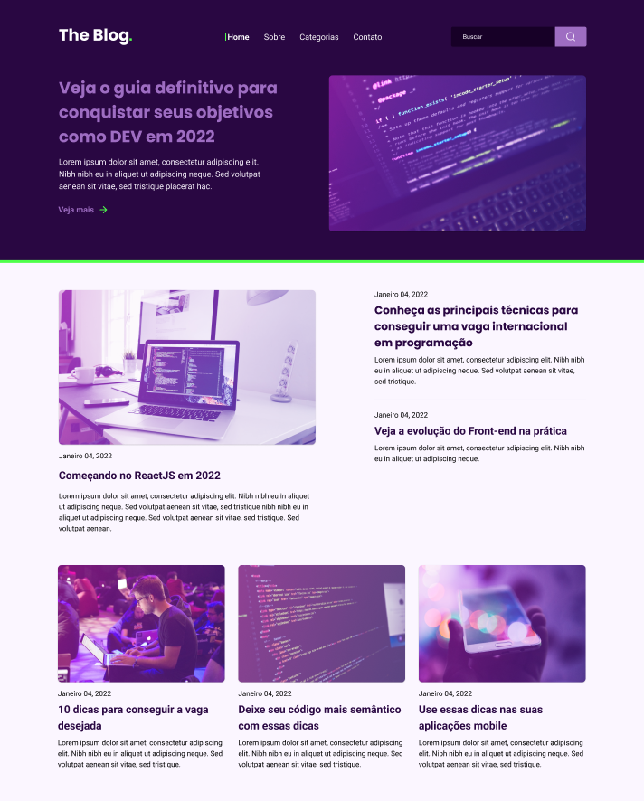

# Blog

## 🎯 Desafio:

Neste desafio, foi proposto a criação de um blog seguindo um design proposto.
 
### Layout disponibilizado:

 

## 🚀 Resultado: 

<a href="https://github.com/braiancalot/blog">Clique aqui para acessar o projeto</a> 

## ⚒️ Tecnologias utilizadas:
* JavaScript
* HTML
* CSS
